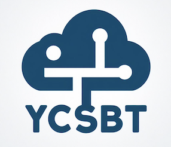
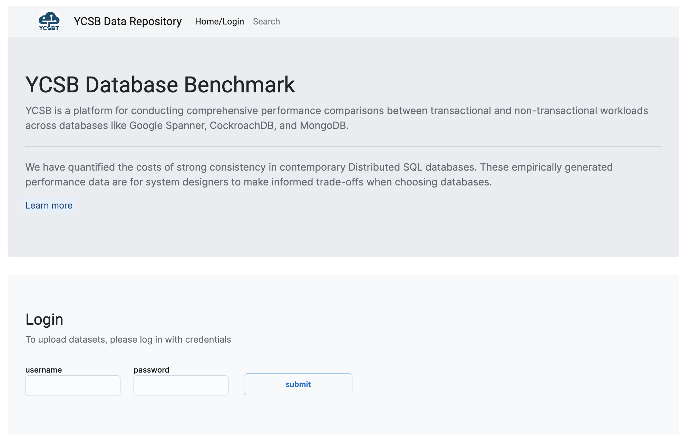
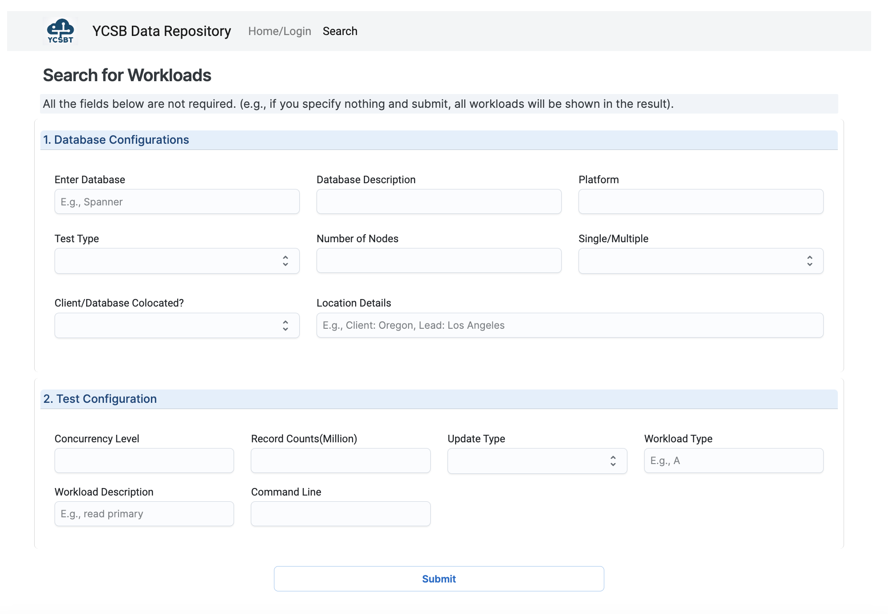
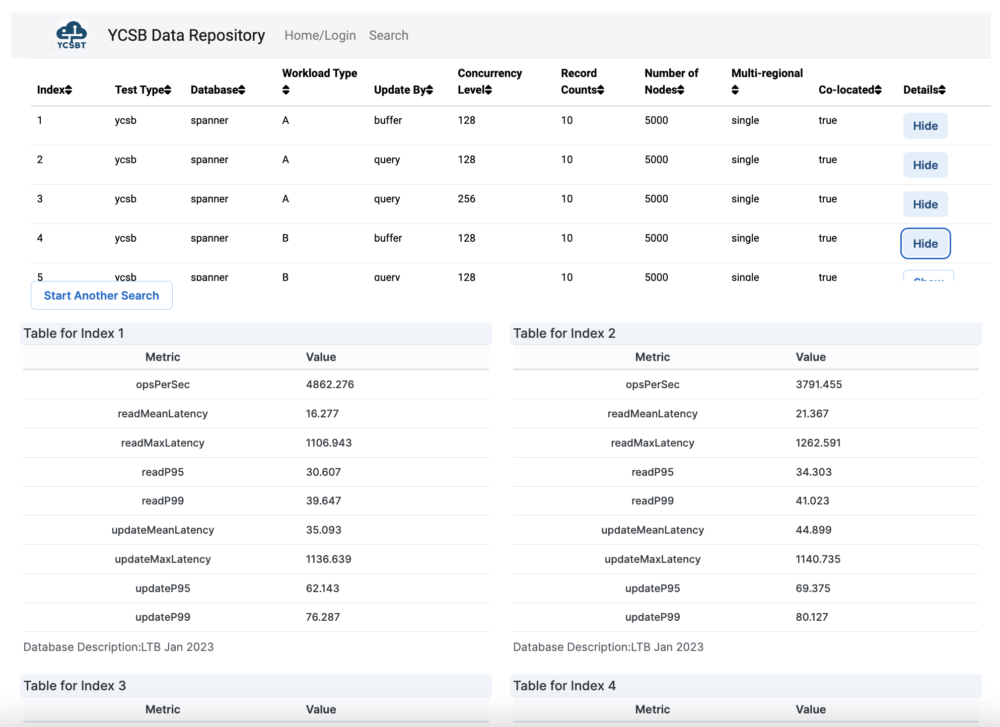
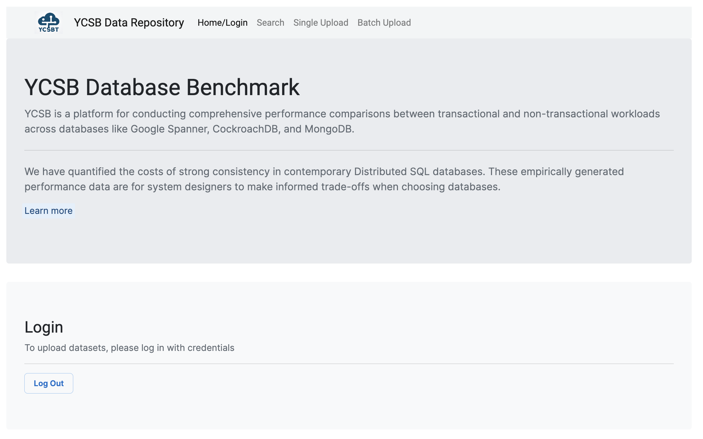
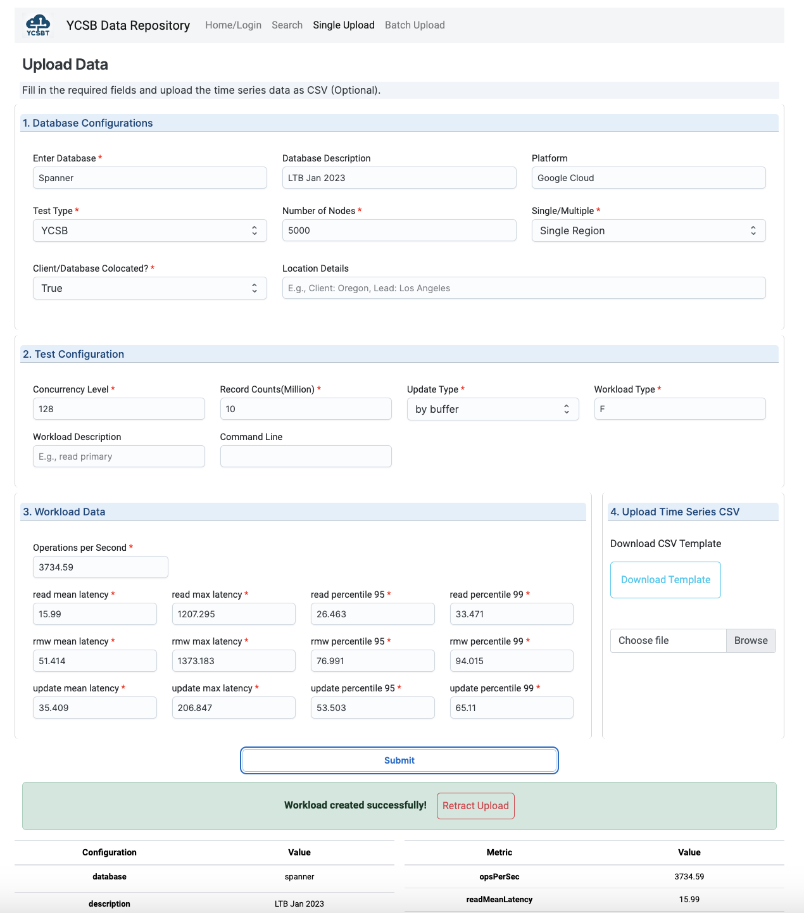
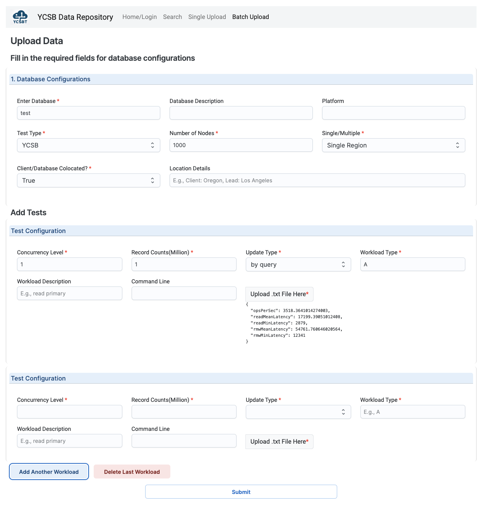

# YCSB Data Repository

  

We have modified the [YCSB github repo](https://github.com/brianfrankcooper/YCSB) for conducting comprehensive performance comparisons between transactional and non-transactional workloads across databases like Google Spanner, CockroachDB, and MongoDB.

[This data repo website](ycsb-data-repo.onrender.com) stores existing workload data and allows users to upload their own datasets.
**Please contact us to get login credentials if you want to upload your datasets.**

### Page Preview

1. Home/Login
   

2. Search
   

3. Result
   

4. Login (if you have requested credentials, then you have access to the upload pages)
   

5. Single Upload (Manually upload all the data fields)
   

6. Batch Upload (Set database configuration once and upload each workload txt result file)
   
